# 0. 사용중인 maven관리용 setting.xml, 설정 저장용 .metadata 업로드

STS는 버전 4.8.1 사용(emmet설치 및 STS3 add-on 설치) 기준

현재 사용중인 그램노트북에 설정한 값임

# 1.인코딩

general - workspace - encoding (UTF-8로 변경)

general - Editors - Text Editors - Speling - encoding(UTF-8)

WEB - CSS Files - encoding (UTF - 8)

WEB - HTML Files - encoding (UTF - 8)

WEB - JSP Files - encoding (UTF - 8)

JSON - JSON Files - encoding (UTF - 8)

추가적으로 스펠링 확인 기능 꺼버렸음

# 2.테마변경

general - appearance - Dark, use round tabs

# 3.오토 임포트 활성화

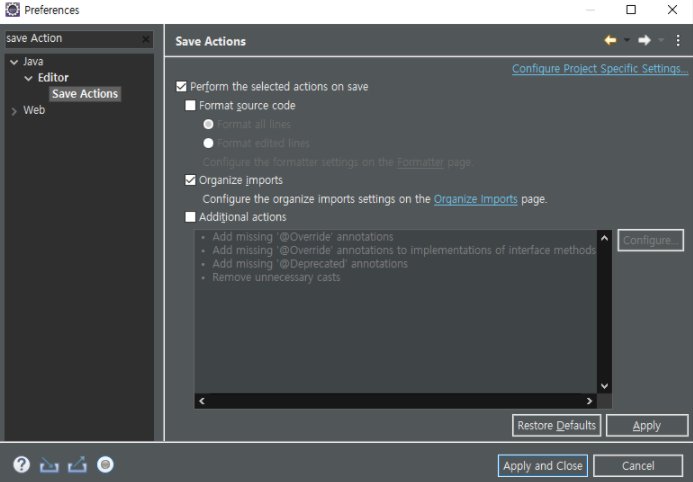

# 4. Ctrl + Space

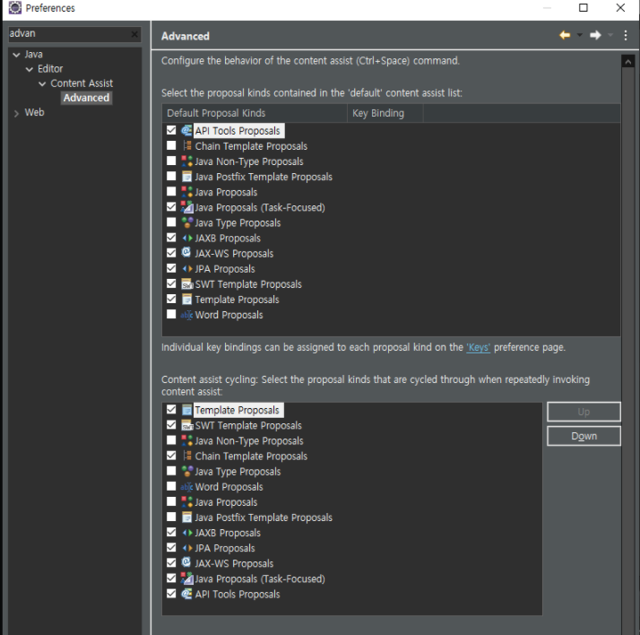

# 5.톰캣 얹기

Server - Runtime Enviroment - add

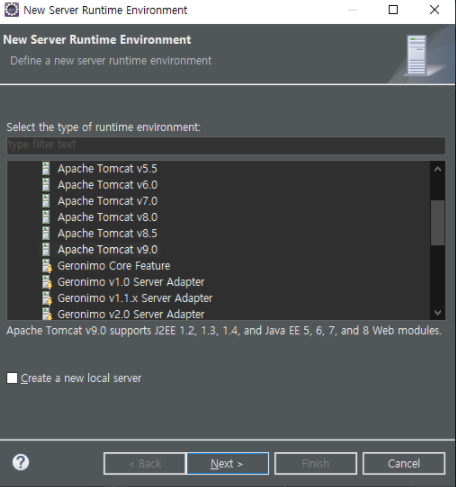

해당하는 톰캣 버전 선택

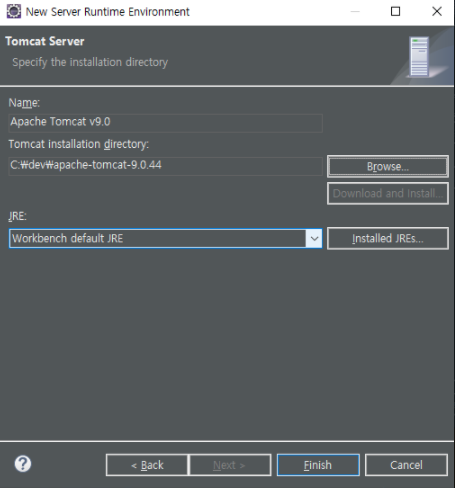

# 6. installed JREs 설정

기존에 내가 사용하던 설정값으로 변경해주고

추가적으로 STS에서는 한가지 추가로 변경해줌

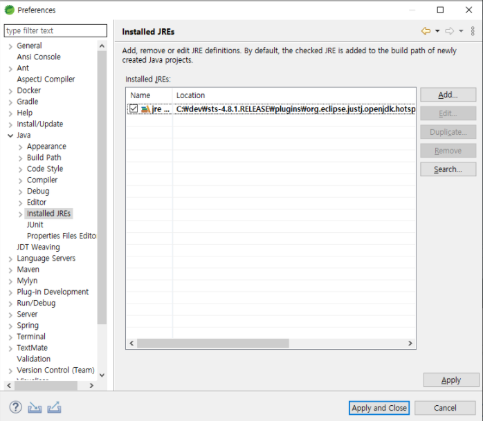

JAVA - installed JREs 기존값

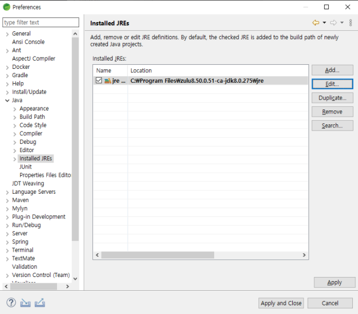

변경후 값

# 7. Maven라이브러리 관리 setting.xml 위치시키기

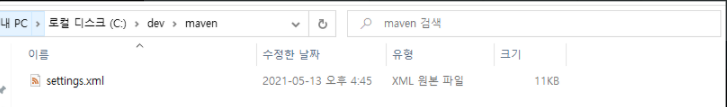

dev/maven폴더를 새로만들고 강사님이 주신 setting.xml을 넣어줬음

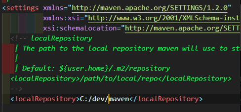

settings 태그 안에 localRepository 태그 안에 내가 메이븐으로 관리하는 라이브러리
다운 경로 설정

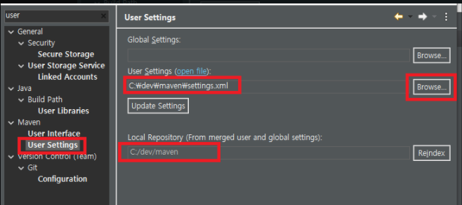

brosw를 눌러서 세팅xml파일을 업로드해주면 아래 경로가 변경된걸 볼수있다.

# 7. emmet설치 및 ctrl+d 라인삭제 단축키 겹침 설정

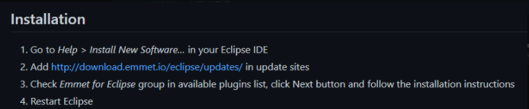

emmet도 설치하고 설정해줬음(jsp, java 추가)

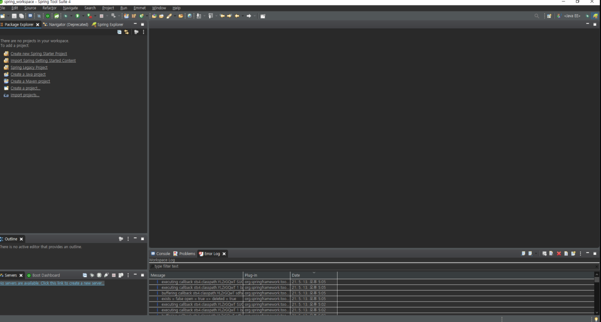

perspective = Spring, view설정은 위와 같음

# 8. 주석 색 설정

XML, JSP, JAVA파일 초록색으로 주석 설정함

# 9. 콘솔 버퍼 설정

ansi콘솔 버퍼 limit 해제

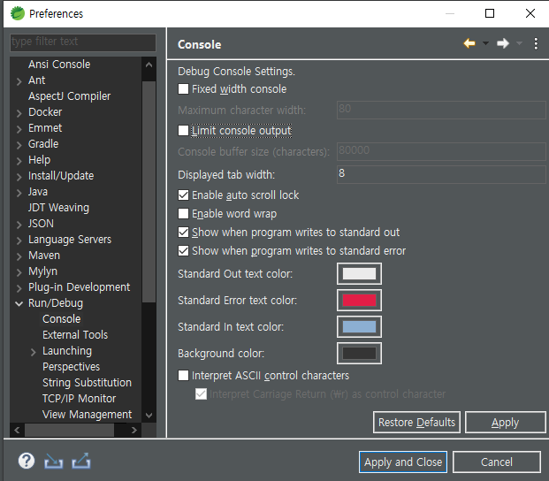
